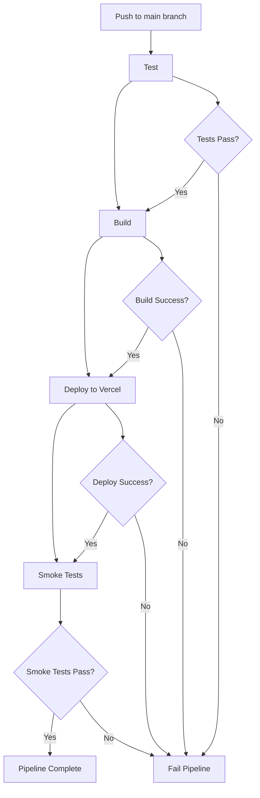

# CI/CD Pipeline Diagram

## Pipeline Overview

The CI/CD pipeline automates the process of testing, building, and deploying the Matrix Software Implementation application.

## Pipeline Stages

## Pipeline Steps Details

### 1. Test Stage
- Runs on every push to main and pull requests
- Uses Node.js 18
- Installs dependencies with `npm ci`
- Executes unit tests with `npm test` (Jest)

### 2. Build Stage
- Only runs on pushes to main branch
- Ensures build process completes (currently no build step required)
- Prepares application for deployment

### 3. Deploy Stage
- Deploys to Vercel using Vercel CLI
- Uses production deployment (`--prod`)
- Requires Vercel secrets: `VERCEL_TOKEN`, `VERCEL_ORG_ID`, `VERCEL_PROJECT_ID`

### 4. Smoke Test Stage
- Runs after successful deployment
- Waits 30 seconds for deployment to be ready
- Tests homepage loads (HTTP 200)
- Tests API endpoint returns 200
- Fails pipeline if any test fails

## Triggers
- **Push to main**: Full pipeline (test → build → deploy → smoke tests)
- **Pull Request to main**: Only test stage

## Secrets Required
- `VERCEL_TOKEN`: Vercel authentication token
- `VERCEL_ORG_ID`: Vercel organization ID
- `VERCEL_PROJECT_ID`: Vercel project ID

## Environment
- Ubuntu latest
- Node.js 18
- NPM cache enabled